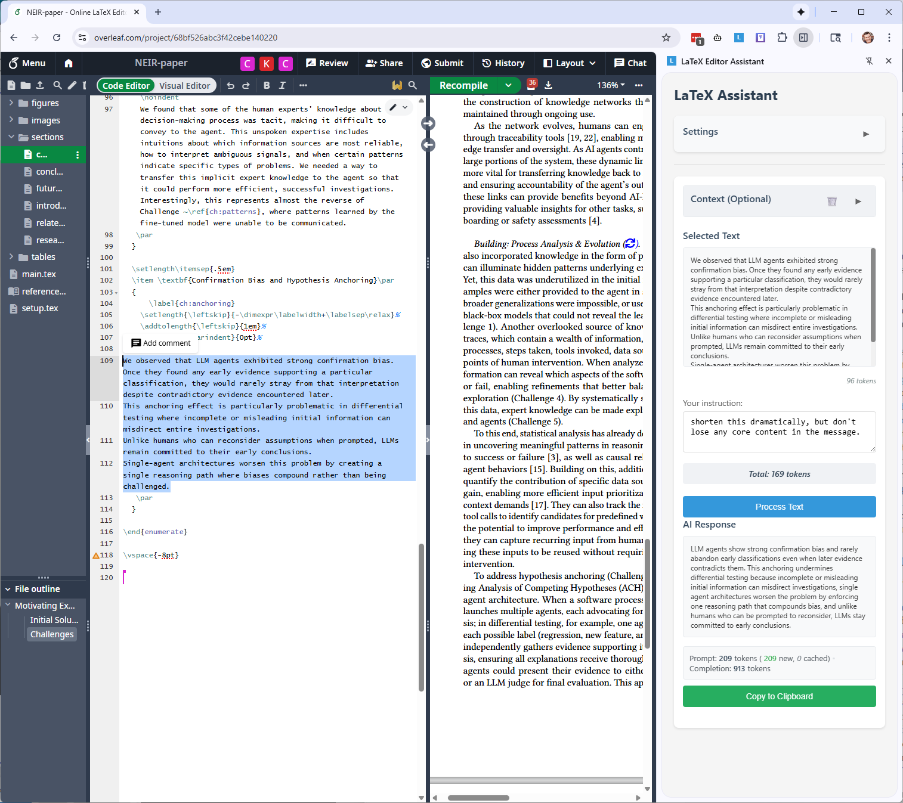

# LaTeX Editor Assistant Chrome Extension

A Chrome extension that provides AI-powered LaTeX editing assistance using Azure OpenAI or standard OpenAI API. Features include text selection from web pages, context management, accurate token counting, and support for multiple model configurations.
 
The extension runs fully locally in your browser (except for API calls to the LLM). All settings, API keys, contexts, etc., are stored locally in your browser's extension storage and never leave your device.



## Features

- **Text Selection**: Highlight text in any webpage (especially useful for Overleaf)
- **Multiple Model Configurations**: Switch between different model providers and configurations
- **Dual Provider Support**: Works with both Azure OpenAI and standard OpenAI API
- **Context Management**: Save and load multiple named contexts for reuse
- **Token Counting**: Real-time, accurate token counting using OpenAI's o200k tokenizer
- **Customizable Prompts**: Define your own prompt templates with variable substitution
- **Token Usage Tracking**: See prompt, completion, and cached token usage after each request
- **Collapsible UI**: Settings and context sections can be collapsed to save space
- **Loading Indicators**: Visual feedback during API calls

## Setup Instructions

### 1. Install the Extension
1. Open Chrome and navigate to `chrome://extensions/`
2. Enable "Developer mode" (toggle in top right)
3. Click "Load unpacked"
4. Select this extension directory

### 2. Configure Your AI Provider

#### First-Time Setup
1. Click the extension icon in Chrome toolbar to open the side panel
2. Click on "Settings" header to expand settings (starts collapsed)
3. Select "+ New Configuration" from the dropdown
4. Choose your provider and enter configuration details:

**For Azure OpenAI:**
- **Configuration Name**: e.g., "GPT-4 Production"
- **Provider**: Select "Azure OpenAI"
- **API Key**: Your Azure OpenAI API key
- **Azure Endpoint**: e.g., `https://your-resource.openai.azure.com`
- **Deployment Name**: Your model deployment name

**For OpenAI:**
- **Configuration Name**: e.g., "GPT-5 API"
- **Provider**: Select "OpenAI"
- **API Key**: Your OpenAI API key
- **Model**: Select from dropdown (GPT-5, GPT-4, etc.)

5. Click "Save" button next to the configuration name

#### Managing Multiple Configurations
- **Add New**: Select "+ New Configuration" from dropdown
- **Switch**: Select a configuration from dropdown (automatically loads)
- **Update**: Make changes and click "Save" (creates new config if name changed)
- **Delete**: Click the trash icon next to the dropdown

## Usage Guide

### Basic Usage
1. Navigate to any webpage with text (e.g., Overleaf)
2. Click the extension icon to open the side panel
3. Select a model configuration from the dropdown in settings
4. Highlight text in the webpage - it appears in "Selected Text" section
5. Type your instruction (e.g., "Can you improve this sentence?")
6. Click "Process Text"
7. View the response and token usage details
8. Click "Copy to Clipboard" to use the improved text

### Using Context (Optional)
The Context section allows you to provide additional background information (for instance, I often include the full latex source of my paper):

1. Click "Context (Optional)" header to expand
2. Paste your context (e.g., the full paper you're working on)
3. Save contexts for reuse:
   - Enter a name and click "Save"
   - Select saved contexts from the dropdown (auto-loads)
   - Delete saved contexts with the "Delete" button

### Customizing Prompt Templates
In Settings, modify the "Prompt Template" to customize how your prompts are structured:
- Use `{{LATEX_TEXT}}` for the selected text
- Use `{{INSTRUCTIONS}}` for your instructions
- Use `{{CONTEXT}}` for additional context

Example template:
```
You are editing a research paper.

Context: {{CONTEXT}}

Selected text to edit:
{{LATEX_TEXT}}

Instructions: {{INSTRUCTIONS}}
```

### Understanding Token Counts
The extension shows real-time token counts for:
- **Context**: Tokens in your context field
- **Selected Text**: Tokens in highlighted text
- **Total**: Combined tokens for the full prompt
- **Response Usage**: After processing, see prompt tokens (new vs cached) and completion tokens

The total turns yellow when approaching model limits (>120k tokens).

## Tips for Best Results

1. **Be Specific**: Clear instructions get better results (e.g., "Make this more concise while maintaining technical accuracy")
2. **Use Context**: For better coherence, provide the surrounding paragraphs or full paper as context
3. **Save Common Contexts**: If working on the same document, save it as a named context for quick reuse
4. **Monitor Tokens**: Keep an eye on token counts to avoid hitting limits
5. **Multiple Configs**: Set up different configurations for different models or projects

## Troubleshooting

- **No text appearing**: Make sure you've highlighted text in the webpage
- **API errors**: Verify your Azure OpenAI credentials and endpoint
- **Token count warnings**: Reduce context or selected text if approaching limits
- **Extension not loading**: Check that all files are in place

## Files Structure

- `manifest.json` - Extension configuration
- `sidepanel.html/css/js` - Side panel UI and logic
- `content.js` - Text selection handler
- `background.js` - Extension background service
- `o200k_base.js` - OpenAI tokenizer for accurate counting
- `icon-*.png` - Extension icons
